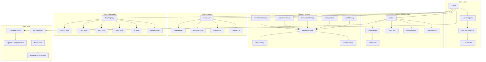

# Calute 🤖

**Calute** is a powerful, production-ready framework for building and orchestrating AI agents with advanced function calling, memory systems, and multi-agent collaboration capabilities. Designed for both researchers and developers, Calute provides enterprise-grade features for creating sophisticated AI systems.

## 🚀 Key Features

### Core Capabilities

- **🎭 Multi-Agent Orchestration**: Seamlessly manage and coordinate multiple specialized agents with dynamic switching based on context, capabilities, or custom triggers
- **⚡ Enhanced Function Execution**: Advanced function calling with timeout management, retry policies, parallel/sequential/pipeline execution strategies, and comprehensive error handling
- **🧠 Advanced Memory Systems**: Sophisticated memory management with multiple types (short-term, long-term, contextual, entity, user), vector search, and persistence
- **🔄 Workflow Engine**: Define and execute complex multi-step workflows with conditional logic and state management via the Cortex framework
- **🌊 Streaming Support**: Real-time streaming responses with function execution tracking
- **🔌 LLM Flexibility**: Unified interface supporting OpenAI, Anthropic (Claude), Gemini, Ollama, and custom models

### Enhanced Features

- **Memory Store with Indexing**: Fast retrieval with tag-based indexing and importance scoring
- **Function Registry**: Centralized function management with metrics and validation
- **Error Recovery**: Robust error handling with customizable retry policies and fallback strategies
- **Performance Monitoring**: Built-in metrics collection for execution times, success rates, and resource usage
- **Context Management**: Sophisticated context passing and compaction strategies for managing token limits
- **Security Features**: Function validation, safe execution environments, and access control

## 📦 Installation

### Core Installation (Lightweight)

```bash
# Minimal installation with only essential dependencies
pip install calute
```

### Feature-Specific Installations

```bash
# For web search capabilities
pip install "calute[search]"

# For image/vision processing
pip install "calute[vision]"

# For additional LLM providers (Gemini, Anthropic, Cohere)
pip install "calute[providers]"

# For database support (PostgreSQL, MongoDB, etc.)
pip install "calute[database]"

# For Redis caching/queuing
pip install "calute[redis]"

# For monitoring and observability
pip install "calute[monitoring]"

# For vector search and embeddings
pip install "calute[vectors]"
```

### Preset Configurations

```bash
# Research-focused installation (search, vision, vectors)
pip install "calute[research]"

# Enterprise installation (database, redis, monitoring, providers)
pip install "calute[enterprise]"

# Full installation with all features
pip install "calute[full]"
```

### Development Installation

```bash
git clone https://github.com/erfanzar/calute.git
cd calute
pip install -e ".[dev]"
```

## 🎯 Quick Start

### Basic Agent Setup

```python
import openai
from calute import Agent, Calute

# Initialize your LLM client
client = openai.OpenAI(api_key="your-key")

# Create an agent with functions
def search_web(query: str) -> str:
    """Search the web for information."""
    return f"Results for: {query}"

def analyze_data(data: str) -> dict:
    """Analyze provided data."""
    return {"summary": data, "insights": ["insight1", "insight2"]}

agent = Agent(
    id="research_agent",
    name="Research Assistant",
    model="gpt-4",
    instructions="You are a helpful research assistant.",
    functions=[search_web, analyze_data],
    temperature=0.7
)

# Initialize Calute and register agent
calute = Calute(client)
calute.register_agent(agent)

# Use the agent
response = await calute.create_response(
    prompt="Find information about quantum computing",
    agent_id="research_agent"
)
```

### Using LLM Providers Directly

```python
from calute.llms import create_llm, OpenAILLM, AnthropicLLM, GeminiLLM

# Using the factory function
llm = create_llm("openai", model="gpt-4", api_key="your-key")

# Or instantiate directly
openai_llm = OpenAILLM(api_key="your-key", model="gpt-4")
anthropic_llm = AnthropicLLM(api_key="your-key", model="claude-3-opus")
gemini_llm = GeminiLLM(api_key="your-key", model="gemini-pro")

# Generate completions
response = await openai_llm.generate_completion(
    messages=[{"role": "user", "content": "Hello!"}]
)
```

### Advanced Memory-Enhanced Agent

```python
from calute.memory import ShortTermMemory, LongTermMemory, ContextualMemory

# Create different memory types for different use cases
short_term = ShortTermMemory(max_items=100)
long_term = LongTermMemory(storage_path="./agent_memory")
contextual = ContextualMemory()

# Save memories with metadata
short_term.save(
    content="User prefers technical explanations",
    metadata={"source": "user_feedback", "importance": 0.9}
)

# Search memories
results = long_term.search("user preferences", limit=5)
```

### Multi-Agent Collaboration with Cortex

```python
from calute.cortex import Cortex, CortexAgent, CortexTask, ProcessType
from calute.llms import OpenAILLM

# Create specialized agents
researcher = CortexAgent(
    role="Research Analyst",
    goal="Gather and analyze information",
    backstory="Expert in data research and analysis"
)

analyst = CortexAgent(
    role="Data Analyst",
    goal="Process and interpret data findings",
    backstory="Specialist in statistical analysis"
)

writer = CortexAgent(
    role="Technical Writer",
    goal="Create clear documentation",
    backstory="Expert in technical communication"
)

# Define tasks
research_task = CortexTask(
    description="Research the latest trends in AI",
    expected_output="Comprehensive research report",
    agent=researcher
)

analysis_task = CortexTask(
    description="Analyze the research findings",
    expected_output="Statistical analysis with insights",
    agent=analyst,
    context=[research_task]  # Depends on research output
)

# Create and run the Cortex orchestrator
llm = OpenAILLM(api_key="your-key")
cortex = Cortex(
    agents=[researcher, analyst, writer],
    tasks=[research_task, analysis_task],
    llm=llm,
    process=ProcessType.SEQUENTIAL  # or PARALLEL, HIERARCHICAL, CONSENSUS
)

result = cortex.kickoff()
print(result.raw_output)
```

## 📚 Example Scenarios

The `examples/` directory contains comprehensive scenarios demonstrating Calute's capabilities:

1. **Conversational Assistant** (`scenario_1_conversational_assistant.py`)
   - Memory-enhanced chatbot with user preference learning
   - Sentiment analysis and context retention

2. **Code Analyzer** (`scenario_2_code_analyzer.py`)
   - Python code analysis with security scanning
   - Refactoring suggestions and test generation
   - Parallel analysis execution

3. **Multi-Agent Collaboration** (`scenario_3_multi_agent_collaboration.py`)
   - Coordinated task execution across specialized agents
   - Dynamic agent switching based on context
   - Shared memory and progress tracking

4. **Streaming Research Assistant** (`scenario_4_streaming_research_assistant.py`)
   - Real-time streaming responses
   - Knowledge graph building
   - Research synthesis and progress tracking

## 🏗️ Architecture

Calute is built with a modular architecture that separates concerns and allows for flexible composition:



## 📁 Project Structure

```
calute/
├── __init__.py              # Main package exports and version
├── calute.py                # Core Calute class for agent management
├── executors.py             # Function execution and agent orchestration
├── basics.py                # Basic function utilities and decorators
├── config.py                # Configuration management
├── errors.py                # Custom exception classes
├── utils.py                 # Utility functions and base classes
├── multimodal.py            # Image and multimodal content handling
├── streamer_buffer.py       # Streaming response buffer management
│
├── cortex/                  # Multi-agent orchestration framework
│   ├── cortex.py            # Main Cortex orchestrator
│   ├── agent.py             # CortexAgent definition
│   ├── task.py              # CortexTask and task chaining
│   ├── tool.py              # CortexTool wrapper
│   ├── planner.py           # AI-powered task planning
│   ├── memory_integration.py # Memory system for Cortex
│   ├── universal_agent.py   # Flexible universal agents
│   ├── dynamic.py           # Dynamic workflow creation
│   ├── templates.py         # Prompt templates
│   └── enums.py             # Process types and enumerations
│
├── llms/                    # LLM provider integrations
│   ├── base.py              # BaseLLM abstract class and LLMConfig
│   ├── openai.py            # OpenAI/OpenAI-compatible providers
│   ├── anthropic.py         # Anthropic Claude integration
│   ├── gemini.py            # Google Gemini integration
│   └── ollama.py            # Ollama local model support
│
├── memory/                  # Memory management system
│   ├── base.py              # Memory abstract base class
│   ├── short_term_memory.py # Conversation-scope memory
│   ├── long_term_memory.py  # Persistent cross-session memory
│   ├── contextual_memory.py # Context-aware memory
│   ├── entity_memory.py     # Entity tracking memory
│   ├── user_memory.py       # User-specific memory
│   ├── storage.py           # Storage backends (Simple, SQLite, RAG)
│   └── compat.py            # Legacy compatibility layer
│
├── tools/                   # Built-in tool implementations
│   ├── coding_tools.py      # File operations, git, code analysis
│   ├── data_tools.py        # JSON, CSV, text processing
│   ├── math_tools.py        # Calculator, statistics, unit conversion
│   ├── ai_tools.py          # Embedding, classification, summarization
│   ├── web_tools.py         # Web scraping, API clients
│   ├── system_tools.py      # System info, process management
│   ├── memory_tool.py       # Memory persistence tools
│   ├── standalone.py        # Standalone tool classes
│   └── duckduckgo_engine.py # Web search integration
│
├── types/                   # Type definitions and data structures
│   ├── agent_types.py       # Agent, AgentFunction definitions
│   ├── messages.py          # Message types and conversation history
│   ├── function_execution_types.py  # Execution status, strategies
│   ├── tool_calls.py        # Tool and function call types
│   ├── converters.py        # Format conversion utilities
│   └── oai_protocols.py     # OpenAI protocol types
│
├── context_management/      # Context window management
│   ├── compaction_strategies.py  # Smart, sliding window, summarization
│   └── token_counter.py     # Multi-provider token counting
│
├── mcp/                     # Model Context Protocol integration
│   ├── client.py            # MCP client implementation
│   ├── manager.py           # Multi-server management
│   ├── integration.py       # Agent-MCP integration utilities
│   └── types.py             # MCP type definitions
│
├── api_server/              # OpenAI-compatible API server
│   ├── server.py            # FastAPI server implementation
│   ├── routers.py           # API route definitions
│   ├── models.py            # Pydantic request/response models
│   ├── completion_service.py       # Completion handling
│   └── cortex_completion_service.py  # Cortex-specific completions
│
├── agents/                  # Pre-built specialized agents
│   ├── _coder_agent.py      # Code generation and review
│   ├── _planner_agent.py    # Task planning
│   ├── _researcher_agent.py # Research and information gathering
│   ├── _data_analyst_agent.py # Data analysis
│   ├── compaction_agent.py  # Memory compaction
│   └── auto_compact_agent.py # Automatic context compaction
│
└── ui/                      # User interface components
    ├── application.py       # Main UI application
    ├── helpers.py           # UI helper functions
    └── themes.py            # Theme definitions
```

## 🛠️ Core Components

### Memory System

The memory system provides multiple storage types optimized for different use cases:

| Memory Type | Purpose | Persistence | Use Case |
|------------|---------|-------------|----------|
| `ShortTermMemory` | Conversation context | Session | Current dialogue |
| `LongTermMemory` | Important information | Persistent | Cross-session knowledge |
| `ContextualMemory` | Situation-aware storage | Configurable | Adaptive responses |
| `EntityMemory` | Entity tracking | Persistent | Named entity management |
| `UserMemory` | User preferences | Persistent | Personalization |

Storage backends include `SimpleStorage` (in-memory), `SQLiteStorage` (local persistence), and `RAGStorage` (vector-based semantic retrieval).

### Cortex Framework

Cortex provides advanced multi-agent orchestration with multiple execution strategies:

- **SEQUENTIAL**: Tasks execute one after another, with outputs feeding into subsequent tasks
- **PARALLEL**: Independent tasks run concurrently for maximum throughput
- **HIERARCHICAL**: Manager agents delegate to worker agents
- **CONSENSUS**: Multiple agents collaborate to reach agreement
- **PLANNED**: AI-powered planning determines optimal execution order

### Function Execution

The executor system supports multiple strategies with built-in error handling:

```python
from calute.executors import EnhancedFunctionExecutor, RetryPolicy
from calute.types import FunctionCallStrategy

# Configure retry policy
retry_policy = RetryPolicy(
    max_retries=3,
    initial_delay=1.0,
    exponential_base=2.0,
    jitter=True
)

# Create executor with settings
executor = EnhancedFunctionExecutor(
    orchestrator=orchestrator,
    default_timeout=30.0,
    retry_policy=retry_policy,
    max_concurrent_executions=10
)

# Execute with different strategies
results = await executor.execute_function_calls(
    calls=function_calls,
    strategy=FunctionCallStrategy.PARALLEL
)
```

### Context Management

Manage conversation context within token limits using compaction strategies:

```python
from calute.context_management import (
    SmartCompactionStrategy,
    SmartTokenCounter,
    get_compaction_strategy
)
from calute.types import CompactionStrategy

# Create token counter
counter = SmartTokenCounter(model="gpt-4")
token_count = counter.count_tokens("Hello, world!")

# Get appropriate compaction strategy
strategy = get_compaction_strategy(
    strategy=CompactionStrategy.SMART,  # or SLIDING_WINDOW, SUMMARIZATION, PRIORITY
    target_tokens=4000,
    model="gpt-4"
)
```

### Built-in Tools

Calute provides 50+ built-in tools organized by category:

| Category | Tools | Description |
|----------|-------|-------------|
| **File System** | `ReadFile`, `WriteFile`, `ListDir`, `AppendFile` | File and directory operations |
| **Execution** | `ExecutePythonCode`, `ExecuteShell` | Safe code execution |
| **Web** | `DuckDuckGoSearch`, `WebScraper`, `APIClient` | Web interaction |
| **Data** | `JSONProcessor`, `CSVProcessor`, `TextProcessor` | Data format handling |
| **AI** | `TextEmbedder`, `TextSummarizer`, `TextClassifier` | AI-powered processing |
| **Math** | `Calculator`, `StatisticalAnalyzer`, `UnitConverter` | Mathematical operations |
| **Memory** | `save_memory`, `search_memory`, `consolidate_memories` | Persistent storage |

```python
from calute.tools import get_available_tools, ReadFile, Calculator

# Get all available tools by category
tools = get_available_tools()

# Use standalone tools
content = ReadFile.static_call(file_path="config.json")
result = Calculator.static_call(expression="2 * (3 + 4)")
```

## 📊 Performance & Monitoring

```python
# Access execution metrics
metrics = orchestrator.function_registry.get_metrics("function_name")
print(f"Total calls: {metrics.total_calls}")
print(f"Success rate: {metrics.successful_calls / metrics.total_calls:.0%}")
print(f"Avg duration: {metrics.average_duration:.2f}s")

# Memory statistics
stats = memory.get_statistics()
print(f"Total memories: {stats['total_memories']}")
print(f"Storage used: {stats['storage_bytes']} bytes")
```

## 🔒 Security & Best Practices

- Function validation before execution with parameter checking
- Timeout protection against hanging operations
- Secure memory persistence with encryption support
- Rate limiting and resource management
- Comprehensive error handling and logging
- Safe code execution in sandboxed environments

## 🔌 MCP Integration

Calute supports **Model Context Protocol (MCP)** for connecting agents to external data sources, tools, and APIs:

```python
import asyncio
from calute.cortex import CortexAgent
from calute.llms import OpenAILLM
from calute.mcp import MCPManager, MCPServerConfig
from calute.mcp.integration import add_mcp_tools_to_agent

async def main():
    # Setup MCP manager
    mcp_manager = MCPManager()

    # Configure MCP server (e.g., filesystem access)
    config = MCPServerConfig(
        name="filesystem",
        command="npx",
        args=["-y", "@modelcontextprotocol/server-filesystem", "/data"],
    )

    # Connect to MCP server
    await mcp_manager.add_server(config)

    # Create agent with MCP tools
    agent = CortexAgent(
        role="Data Assistant",
        goal="Help with file operations",
        backstory="Expert with filesystem access",
    )

    # Add MCP tools to agent
    await add_mcp_tools_to_agent(agent, mcp_manager)

    # Use the agent with MCP capabilities
    # The agent now has access to all MCP server tools

    await mcp_manager.disconnect_all()

asyncio.run(main())
```

### Supported MCP Servers

- **Filesystem**: Local file operations
- **SQLite**: Database queries
- **GitHub**: Repository management
- **Brave Search**: Web search capabilities
- **Custom**: Build your own MCP servers

## 🖥️ API Server

Deploy Calute agents as an OpenAI-compatible API:

```python
from calute import Calute, OpenAILLM
from calute.api_server import CaluteAPIServer
from calute.types import Agent

# Setup
llm = OpenAILLM(api_key="your-api-key")
calute = Calute(client=llm.client)
agent = Agent(id="assistant", model="gpt-4", instructions="Help users")

# Create and run server
server = CaluteAPIServer(calute)
server.register_agent(agent)
server.run(port=8000)
```

The server exposes:
- `POST /v1/chat/completions` - Chat completions (streaming and non-streaming)
- `GET /v1/models` - List available models
- `GET /health` - Health check endpoint

## 📖 Documentation

- [API Reference](docs/api.md)
- [Configuration Guide](docs/configuration.md)
- [Memory System](docs/memory.md)
- [Multi-Agent Patterns](docs/patterns.md)
- [Performance Tuning](docs/performance.md)
- [MCP Integration Guide](docs/mcp_integration.md)

## 🤝 Contributing

We welcome contributions! Please see our [Contributing Guidelines](CONTRIBUTING.md) for details.

### Development Setup

```bash
# Install with dev dependencies
pip install -e ".[dev]"

# Run tests
pytest tests/

# Run linting
ruff check calute/

# Format code
black calute/
```

## 📄 License

This project is licensed under the Apache License 2.0 - see the [LICENSE](LICENSE) file for details.

## 🙏 Acknowledgments

Built with ❤️ by [erfanzar](https://github.com/erfanzar) and contributors.

## 📬 Contact

- GitHub: [@erfanzar](https://github.com/erfanzar)
- Issues: [GitHub Issues](https://github.com/erfanzar/calute/issues)

---

**Note**: This is an active research project. APIs may change between versions. Please pin your dependencies for production use.
