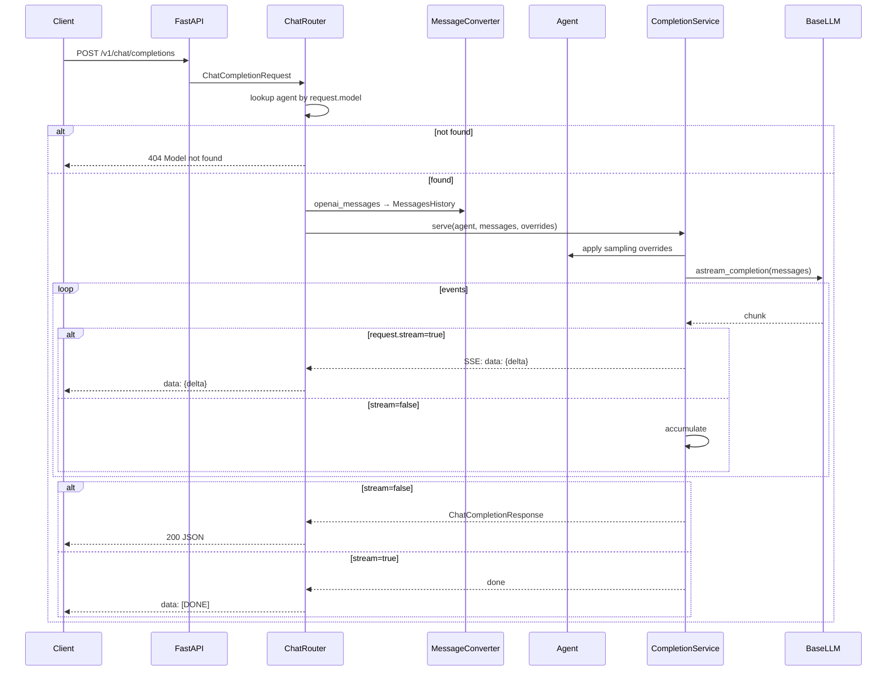

# API Reference

OpenAI-compatible HTTP surface exposed by [xerxes.api_server](../src/python/xerxes/api_server/). Implemented with FastAPI; streaming responses use Server-Sent Events (SSE).

## Starting the server

```python
from xerxes import OpenAILLM, Agent, Xerxes
from xerxes.api_server import XerxesAPIServer

llm = OpenAILLM(api_key="sk-…")
agent = Agent(id="assistant", instructions="Be helpful", model="gpt-4o")
xerxes = Xerxes(llm=llm)
xerxes.register_agent(agent)

server = XerxesAPIServer(agents={"assistant": agent}, xerxes_instance=xerxes)
server.run(host="0.0.0.0", port=8000)
```

The server binds to `host:port` and registers three routers. The `model` field in incoming requests selects which registered agent handles the call.

## Endpoints

### `POST /v1/chat/completions`

OpenAI-compatible chat completion endpoint. Routes to the agent whose `id` matches the request `model`.

**Request body** (standard OpenAI `ChatCompletionRequest`):

```json
{
  "model": "assistant",
  "messages": [
    {"role": "system", "content": "You are helpful."},
    {"role": "user",   "content": "Hello"}
  ],
  "temperature": 0.7,
  "max_tokens": 512,
  "top_p": 1.0,
  "frequency_penalty": 0.0,
  "presence_penalty": 0.0,
  "stream": false,
  "tools": [...],
  "tool_choice": "auto"
}
```

Per-request sampling params (`temperature`, `top_p`, `max_tokens`, `frequency_penalty`, `presence_penalty`, `stop`) override the agent's defaults when provided.

**Non-streaming response** (`stream: false`):

```json
{
  "id": "chatcmpl-…",
  "object": "chat.completion",
  "created": 1712300000,
  "model": "assistant",
  "choices": [{
    "index": 0,
    "message": {"role": "assistant", "content": "Hello."},
    "finish_reason": "stop"
  }],
  "usage": {"prompt_tokens": 12, "completion_tokens": 1, "total_tokens": 13}
}
```

**Streaming response** (`stream: true`): Server-Sent Events, one `data: <json>` line per chunk, terminated by `data: [DONE]`.

```
data: {"id":"…","object":"chat.completion.chunk","choices":[{"delta":{"role":"assistant"}}]}

data: {"id":"…","object":"chat.completion.chunk","choices":[{"delta":{"content":"Hel"}}]}

data: {"id":"…","object":"chat.completion.chunk","choices":[{"delta":{"content":"lo."}}]}

data: {"id":"…","object":"chat.completion.chunk","choices":[{"delta":{},"finish_reason":"stop"}]}

data: [DONE]
```

**Tool calls (streaming):** tool_start / tool_end events are flattened into `delta.tool_calls` OpenAI-style so unmodified OpenAI SDKs can consume them.

**Errors:**

| Status | Case |
|-------:|------|
| 400 | Malformed JSON, missing `model`, missing `messages` |
| 404 | `model` does not match any registered agent |
| 422 | Pydantic validation error on the request body |
| 500 | Uncaught framework error (audit event emitted) |

### `GET /v1/models`

Lists registered agents as OpenAI `Model` objects. No auth.

**Response:**

```json
{
  "object": "list",
  "data": [
    {"id": "assistant", "object": "model", "created": 1712300000, "owned_by": "xerxes"},
    {"id": "coder",     "object": "model", "created": 1712300000, "owned_by": "xerxes"}
  ]
}
```

Exact Pydantic shapes: [xerxes.api_server.models.ModelInfo](../src/python/xerxes/api_server/models.py), [ModelsResponse](../src/python/xerxes/api_server/models.py).

### `GET /health`

Liveness probe. Returns `{"status": "healthy", "agents": <count>}` when the server has ≥1 registered agent. Suitable for LB / orchestrator health checks.

### `POST /v1/cortex/completions` (optional)

Enabled when `XerxesAPIServer` is constructed with a `Cortex` instance. Same request shape as `/v1/chat/completions` but the `model` field selects a Cortex configuration instead of a single agent; responses stream the full multi-task orchestration (task start / task end events are interleaved with text deltas).

See [xerxes.api_server.cortex_completion_service](../src/python/xerxes/api_server/cortex_completion_service.py) for details.

## Compatibility

The server implements enough of the OpenAI chat-completions surface to be a drop-in for:

- `openai-python` SDK (`OpenAI(base_url="http://host:8000/v1", api_key="any")`).
- LangChain `ChatOpenAI` pointed at the server.
- LiteLLM / similar routing proxies.
- Any tool that speaks the OpenAI wire protocol.

**Not implemented:**

- `/v1/completions` (legacy text completions — OpenAI deprecated; use `/v1/chat/completions`).
- `/v1/embeddings` (use the `xerxes.memory` embedders directly, or run a separate embedding server).
- `/v1/images/*`, `/v1/audio/*` (no media generation in-framework; use provider APIs directly).
- Function calling via the `functions` parameter (deprecated; use `tools` instead).

## Auth

The base server ships **without auth.** Wire up whatever middleware you need — FastAPI dependency injection makes it one decorator on the router. A minimal bearer-token check:

```python
from fastapi import Depends, HTTPException, Header

def verify_token(authorization: str = Header(...)):
    if authorization != f"Bearer {os.environ['XERXES_API_KEY']}":
        raise HTTPException(401, "Invalid token")

server = XerxesAPIServer(agents=..., dependencies=[Depends(verify_token)])
```

## Request → agent → response flow



## Observing the server

Enable `RuntimeFeaturesConfig` on the underlying Xerxes instance to get:

- Audit events for every turn (written to JSONL if `audit_emitter` is wired with `JSONLSinkCollector`).
- Prometheus metrics at `/metrics` if `prometheus-client` is installed: `xerxes_tool_calls_total`, `xerxes_turn_duration_seconds`, `xerxes_tokens_consumed_total`, `xerxes_cost_usd_total`.
- OpenTelemetry traces if `opentelemetry-sdk` is installed and `OTEL_EXPORTER_*` env vars are set (see [configuration-guide.md](configuration-guide.md)).

See also:

- [system-architecture.md](system-architecture.md) — how the server fits into the broader runtime.
- [deployment-guide.md](deployment-guide.md) — running the server in Docker / as a daemon.
- [configuration-guide.md](configuration-guide.md) — env vars and `XerxesConfig` fields that affect server behavior.
